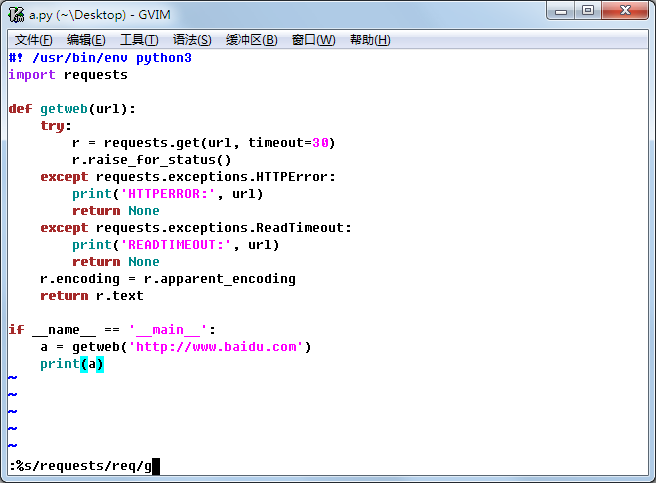

替换
############################

替换是文档编辑中最常用的操作之一。vim 可以用一条命令完成替换操作。

基本替换操作
****************************

在 Vim 的普通模式下，先输入冒号 ``:`` 进入命令行模式，然后在输入替换命令，语法为：

.. highlight:: none

::

    :[addr]s/源字符串/目标字符串/[option]

**[addr] 表示检索范围，省略时为当前行**

- ``1，20`` ：表示从第 1 行到 20 行
- ``%`` ：表示整个文件，同 ``1,``
- ``.,`` ：从当前行到文件尾

**s 表示替换操作**

**[option] 表示操作类型**

- ``g`` 表示全局替换
- ``c`` 表示进行确认
- ``p`` 表示替代结果逐行显示（Ctrl + L恢复屏幕）
- 省略 option 时仅对每行第一个匹配串进行替换

应用实例
****************************

1. 将所有的 requests 替换为 req

::

    :%s/requests/req/g

2. 将所有的 requests 替换为 req，并逐个要求确认

::

    :%s/requests/req/c

3. 在每行的开头插入两个空格

::

    :%s/^/  /

4. 在 3 至 15 行末尾加入 ...

::

    :3,15s/$/.../

5. 删除所有空行

::

    :g/^$/d

:g 和 :s 的区别
****************************

global 命令是 Vim 最强大的命令之一。global 命令在 [range] 指定的文本范围内（缺省为整个文件）查找 {pattern}，然后对匹配到的行执行命令 {command}，如果希望对没匹配上的行执行命令，则使用 global! 或 vglobal 命令。

来看一个经典例子：

::

    :g/^/m 0

这条命令用行首标记 /^/ 匹配文件的所有行，然后用 move 命令依次将每行移到第一行（第 0 行的下一行），从而实现了倒序功能。

global命令实际上是分成两步执行：

- 首先扫描 [range] 指定范围内的所有行，给匹配 {pattern} 的行打上标记。注意：标记的概念很重要。
- 然后依次对打有标记的行执行 {command} 命令，如果被标记的行在对之前匹配行的命令操作中被删除、移动或合并，则其标记自动消失，而不对该行执行 {command} 命令。

global 与 substitute
============================

不少 vimmer 觉得这两个命令差不多，的确，它们的形式很相似，都是要进行查找匹配，只不过 substitute 执行的是替换而 global 执行的是其它命令。先看例子，体会一下 :s 和 :g 不同的思维方式。

::

    :%s/.*/&\r&/

    :g/^/t.

- substitue 是查找任意行，然后替换为两行夹回车
- global 是将每一行复制（:t就是:copy）到自己下面。
