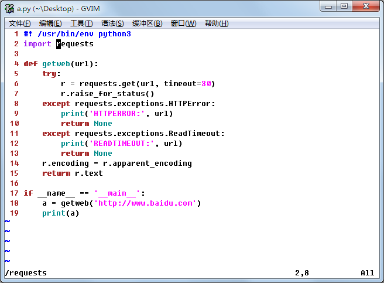
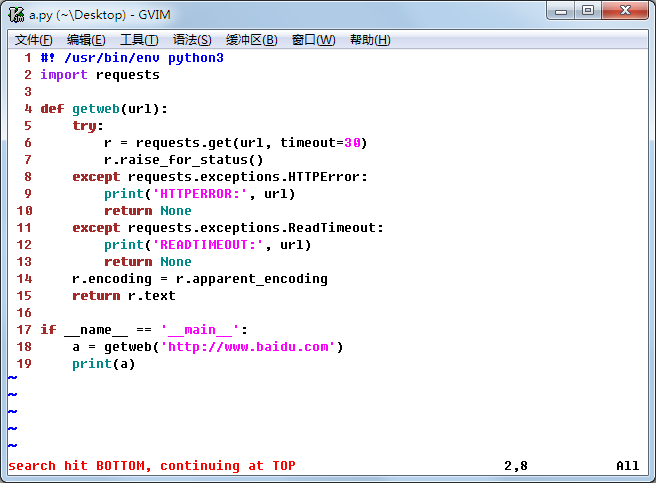
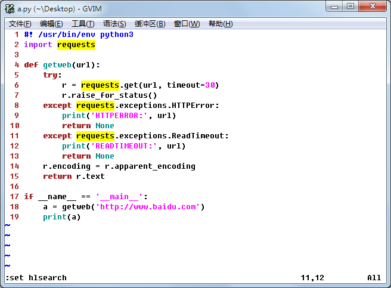
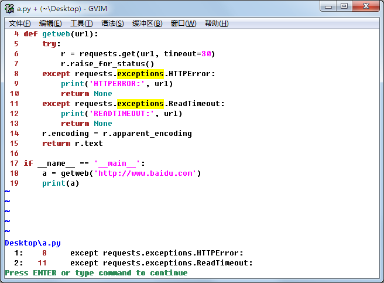

搜索
########################

在“码砖”的过程中，搜索是最常用的操作之一。vim 可以在当前文件中搜索，也可以在多个文件中搜索。

基本搜索操作
************************

要在文档中搜索一个特定的单词或模板时，首先进入命令行模式，然后输入 ``/`` 并紧接着输入你要搜索的单词或搜索模式，最后回车搜索。

按 ``n`` 键，跳到下一个匹配单词的位置。当你遍历完所有搜索结果之处，继续按 ``n`` 键 Vim 将重复搜索操作，光标将回到第一次搜索结果出现的位置。

   
在遍历搜索结果时，如果想要回到上一匹配处，可以按 ``N`` 键（即 shift+n）。同时，不管在什么时候，都可以用 ``ggn`` 来跳转到第一个匹配处，或者 ``GN`` 来跳转到最后一个匹配处。

如果想要逆向搜索（即向上搜索），可以用 ``?`` 代替 ``/`` 来进行搜索。同时可以用 ``n`` 和 ``N`` 进行跳转。

自定义你的搜索
************************

高亮显示搜索结果
========================

虽然通过 ``n`` 或 ``N`` 在搜索单词的匹配处跳转很简单，但是高亮显示匹配结果会更加便于阅读。可以通过设置 hlsearch 变量来实现高亮显示匹配结果，在命令行模式中执行下述命令：

.. highlight:: none

::

    :set hlsearch

   
不区分大小写搜索
========================

搜索默认是区分大小写的。如果想要不区分大小写搜索，可以通过设置 ignorecase 变量来实现，在命令行模式中执行下述命令：

::

    :set ignorecase

递进搜索
========================

就行网页搜索一样，随着你输入查询字串的变化同步更新搜索结果。要使用递进搜索，在命令行模式中执行下述命令：

::

    :set incsearch

禁用 / 启用环形搜索
========================

Vim 默认是启用环形搜索的，就是说在到达搜索单词的最后一处匹配时，如果继续按 ``n`` 光标会再次回到第一次匹配处。希望禁用环形搜索，可以使用如下命令：

::

    :set nowrapscan

再次开启环形搜索，使用如下命令即可：

::

    :set wrapscan

搜索小技巧
************************

在 Vim 这座大山里，还有很多很有用的小技巧等着去发掘去使用。

快速搜索
========================

在搜索一个单词时，只需要将光标移到这个单词下，然后按 ``*`` 就可以快速搜索这个单词的下一处匹配， ``#`` 快速搜索这个单词的上一处匹配。

搜索结果列表
========================

在搜索完成后通过按 ``[I`` 可以获得所有搜索单词匹配处所在的行和行号的列表。

   
如果以上的信息没有过瘾，请前往 `Vim 官方文档 <https://vim.fandom.com/wiki/Searching>` 获得更多技巧。
