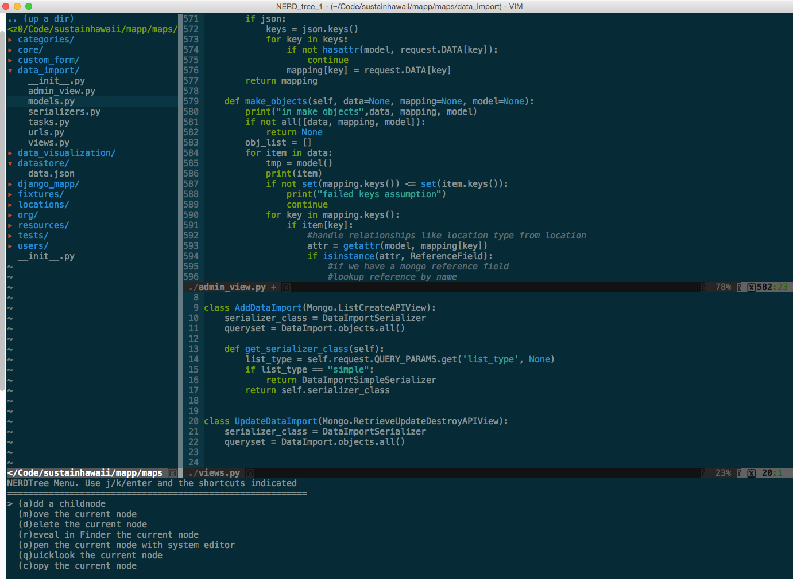

Vim 搭建 Python 环境
#############################

Vim 编辑器无处不在，速度快，从来不会崩溃。并且，它能做任何事情！不过，不利之处也有，就是 Vim 配置起来很让人头疼。但是，别担心！本文将告诉你如何配置一个强大的 Vim 环境，专门用于天天捣鼓 Python 开发。

下面是最终效果预览。

.. note::

    如果想充分地利用好本文，你应该对如何使用Vim和它的命令模式至少有一个基本的了解。如果你是初学者，你可以通过 `vim-adventure`_ 或者 `openvim`_ 网站学习。在继续阅读本文之前，请花点时间浏览那两个网站的内容。

.. _`vim-adventure`: https://vim-adventures.com/
.. _`openvim`: https://www.openvim.com/

安装
*****************************

因为许多 Unix 衍生系统已经预装了 Vim，我们首先要确认编辑器是否成功安装：

.. highlight:: none

::

    [gavin@debian~]$ vim --version

    VIM - Vi IMproved 7.3 (2010 Aug 15, compiled Nov  5 2014 21:00:28)
    Compiled by root@apple.com
    Normal version without GUI.  Features included (+) or not (-):
    -arabic +autocmd -balloon_eval -browse +builtin_terms +byte_offset +cindent
    -clientserver -clipboard +cmdline_compl +cmdline_hist +cmdline_info +comments
    -conceal +cryptv +cscope +cursorbind +cursorshape +dialog_con +diff +digraphs
    -dnd -ebcdic -emacs_tags +eval +ex_extra +extra_search -farsi +file_in_path
    +find_in_path +float +folding -footer +fork() -gettext -hangul_input +iconv
    +insert_expand +jumplist -keymap -langmap +libcall +linebreak +lispindent
    +listcmds +localmap -lua +menu +mksession +modify_fname +mouse -mouseshape
    -mouse_dec -mouse_gpm -mouse_jsbterm -mouse_netterm -mouse_sysmouse
    +mouse_xterm +multi_byte +multi_lang -mzscheme +netbeans_intg -osfiletype
    +path_extra -perl +persistent_undo +postscript +printer -profile +python/dyn
    -python3 +quickfix +reltime -rightleft +ruby/dyn +scrollbind +signs
    +smartindent -sniff +startuptime +statusline -sun_workshop +syntax +tag_binary
    +tag_old_static -tag_any_white -tcl +terminfo +termresponse +textobjects +title
     -toolbar +user_commands +vertsplit +virtualedit +visual +visualextra +viminfo
    +vreplace +wildignore +wildmenu +windows +writebackup -X11 -xfontset -xim -xsmp
     -xterm_clipboard -xterm_save
       system vimrc file: "$VIM/vimrc"
         user vimrc file: "$HOME/.vimrc"
          user exrc file: "$HOME/.exrc"
      fall-back for $VIM: "/usr/share/vim"
    Compilation: gcc -c -I. -D_FORTIFY_SOURCE=0 -Iproto -DHAVE_CONFIG_H -arch i386 -arch x86_64 -g -Os -pipe
    Linking: gcc -arch i386 -arch x86_64 -o vim -lncurses

在这一步，你要确保已经满足以下两点要求：

1. Vim 编辑版本应该大于 7.3。
2. 支持 Python 语言。在所选编辑器的功能中，确保你看到了 ``+python`` 。

如果满足上述要求，接下来可以安装 Vim 扩展了。如果不满足，则需要 `安装/升级`_ 。

.. _`安装/升级`: https://www.vim.org/download.php

Mac OS X
=============================

如果没有 Homebrew_ ，建议马上安装，并运行：

::

    brew update
    brew install vim

.. _Homebrew: https://brew.sh/

UNIX / Linux
=============================

Debian 或 Ubuntu 系统，可以使用下面的代码：

::

    sudo apt-get remove vim-tiny
    apt-get update
    apt-get install vim

如果是其他版本的 Linux 系统，请查阅相应版本包管理器的文档。

Windows
=============================

Windows 系统下安装 Vim 有很多种方法。请查阅 `官方文档`_ 。

.. _`官方文档`: https://www.vim.org/download.php#pc

验证安装
*****************************

确保你已经安装了 7.3 版本以上、支持 Python 的 Vim 编辑器。你可以再次运行 ``vim --version`` 进行确认。如果你想知道 Vim 中使用的 Python 版本，你可以在编辑器中运行: ``python import sys; print(sys.version)`` 。

::

    2.7.6 (default, Sep  9 2014, 15:04:36)
    [GCC 4.2.1 Compatible Apple LLVM 6.0 (clang-600.0.39)]

这行命令会输出你的编辑器当前的 Python 版本。如果报错，那么你的编辑器就不支持 Python 语言，需要重装或重新编译。

Vim 编辑器安装完成后，让我们来看看如何将其设置为 Python 开发的强大环境。

Vim 扩展
*****************************

Vim 本身能够满足开发人员的很多需求，但是它的可扩展性也极强，并且已经有一些杀手级的扩展，可以让 Vim 拥有“现代”集成开发环境的特性。所以，你所需要的第一件东西就是一个好用的扩展管理器。

.. note::

    Vim 的扩展通常也被成为 bundle 或插件。

Vundle
=============================

Vim 有多个扩展管理器，但是我们强烈推荐 Vundle。你可以把它想象成 Vim 的 pip。有了 Vundle，安装和更新包这种事情不费吹灰之力。

现在来安装 Vundle：

::

    [gavin@debian~]$ git clone https://github.com/gmarik/Vundle.vim.git ~/.vim/bundle/Vundle.vim

该命令将下载 Vundle 插件管理器，并将它放置在你的 Vim 编辑器 bundles 文件夹中。现在，你可以通过 ``.vimrc`` 配置文件来管理所有扩展了。

将配置文件添加到你的用户的 home 文件夹中：

::

    [gavin@debian~]$ touch ~/.vimrc

接下来，把下来的Vundle配置添加到配置文件的顶部：

::

    set nocompatible              " required
    filetype off                  " required

    " set the runtime path to include Vundle and initialize
    set rtp+=~/.vim/bundle/Vundle.vim
    call vundle#begin()

    " alternatively, pass a path where Vundle should install plugins
    "call vundle#begin('~/some/path/here')

    " let Vundle manage Vundle, required
    Plugin 'gmarik/Vundle.vim'

    " add all your plugins here (note older versions of Vundle
    " used Bundle instead of Plugin)

    " All of your Plugins must be added before the following line
    call vundle#end()            " required
    filetype plugin indent on    " required

这样，你就完成了使用 Vundle 前的设置。之后，你就可以在配置文件中添加希望安装的插件，然后打开 Vim 编辑器，运行下面的命令：

::

    :PluginInstall

这个命令告诉 Vundle 施展它的魔法——自动下载所有的插件，并为你进行安装和更新。

对于 Windows 用户，请查阅 `Windows 安装指南`_ 。

.. _`Windows 安装指南`: https://github.com/VundleVim/Vundle.vim/wiki/Vundle-for-Windows

开始打造 IDE 吧
*****************************

本文不可能列举 Vim 的全部功能，只能快速介绍一些 Vim 自带的强大功能，它们对于 Python 开发来说是非常有用的。

扔掉鼠标
=============================

或许，Vim 编辑器最重要的功能就是它不要求使用鼠标（除了 GUI 版本外）。一开始，你可能会觉得这是个非常糟糕的做法，但是只要你投入时间——是的，这很花时间——学习快捷组合键，就可以大幅提升工作流的速度。

分割布局（Split Layouts）
=============================

使用 ``:sv <filename>`` 命令打开一个文件，你可以纵向分割布局（新文件会在当前文件下方界面打开），使用相反的命令 ``:vs <filename>`` ，你可以得到横向分割布局（新文件会在当前文件右侧界面打开）。

.. image:: ./images/vimandpython03.jpg

你还可以嵌套分割布局，所以你可以在分割布局内容再进行分割，纵向或横向都可以，直到你满意为止。众所周知，我们开发时经常需要同时查看多个文件。

.. note::

    01. 记得在输入完 ``:sv`` 后，利用 ``tab`` 补全功能，快速查找文件。

    02. 你还可以指定屏幕上可以进行分割布局的区域，只要在 ``.vimrc`` 文件中添加下面的代码即可：

    ::

        set splitbelow
        set splitright

    03. 想要不使用鼠标就切换分割布局吗？只要将下面的代码添加到 ``.vimrc`` 文件中，你就可以通过快捷组合键进行切换。

    ::

        "split navigations
        nnoremap <C-J> <C-W><C-J>
        nnoremap <C-K> <C-W><C-K>
        nnoremap <C-L> <C-W><C-L>
        nnoremap <C-H> <C-W><C-H>

    组合快捷键：

    * Ctrl-j 切换到下方的分割窗口
    * Ctrl-k 切换到上方的分割窗口
    * Ctrl-l 切换到右侧的分割窗口
    * Ctrl-h 切换到左侧的分割窗口

    换句话说, 按 Ctrl+Vim 的标准移动键，就可以切换到指定窗口。

    等等，nnoremap 是什么意思？——简单来说，nnoremap 将一个组合快捷键映射为另一个快捷键。no 部分，指的是在 Vim 的正常模式（Normal Mode）下，而不是可视模式下重新映射。基本上，nnoremap <C-J> <C-W><C-j> 就是说，当我在正常模式按下时，进行操作。

缓冲区（Buffers）
*****************************

虽然 Vim 支持 tab 操作，仍有很多人更喜欢缓冲区和分割布局。你可以把缓冲区想象成最近打开的一个文件。Vim 提供了方便访问近期缓冲区的方式，只需要输入 ``:b <buffer name or number>`` ，就可以切换到一个已经开启的缓冲区（此处也可使用自动补全功能）。你还可以通过 ``ls`` 命令查看所有的缓冲区。

.. note::

    在 ``:ls`` 命令输出的最后，Vim 会提示“敲击 Enter 继续查看”，这时你可以直接输入 ``:b <buffer name>`` ，立即选择缓冲区。这样可以省掉一个按键操作，也不必去记忆缓冲区的名字。

代码折叠（Code Folding）
*****************************

大多数“现代”集成开发环境（IDE）都提供对方法（methods）或类（classes）进行折叠的手段，只显示类或方法的定义部分，而不是全部的代码。

你可以在 ``.vimrc`` 中添加下面的代码开启该功能：

::

    " Enable folding
    set foldmethod=indent
    set foldlevel=99

这样就可以实现，但是你必须手动输入 ``za`` 来折叠（和取消折叠）。使用空格键会是更好的选择。所以在你的配置文件中加上这一行命令吧：

::

    " Enable folding with the spacebar
    nnoremap <space> za

现在你可以轻松地隐藏掉那些当前工作时不需要关注的代码了。

第一个命令，``set foldmethod=ident`` 会根据每行的缩进开启折叠。但是这样做会出现超过你所希望的折叠数目。但是别怕，有几个扩展就是专门解决这个问题的。在这里，我们推荐 SimplyFold。在 ``.vimrc`` 中加入下面这行代码，通过 Vundle 进行安装：

::

    Plugin 'tmhedberg/SimpylFold'

不要忘记执行安装命令：``:PluginInstall``

.. note::

    希望看到折叠代码的文档字符串？

    let g:SimpylFold_docstring_preview=1

Python 代码缩进
*****************************

当然，想要代码折叠功能根据缩进情况正常工作，那么你就会希望自己的缩进是正确的。这里，Vim 的自带功能无法满足，因为它实现不了定义函数之后的自动缩进。我们希望 Vim 中的缩进能做到以下两点：

1. 首先，缩进要符合 PEP 8 标准。
2. 其次，更好地处理自动缩进。

PEP 8
*****************************

要支持 PEP 8 风格的缩进，请在 ``.vimrc`` 文件中添加下面的代码：

::

    au BufNewFile,BufRead *.py
    \ set tabstop=4 |
    \ set softtabstop=4 |
    \ set shiftwidth=4 |
    \ set textwidth=79 |
    \ set expandtab |
    \ set autoindent |
    \ set fileformat=unix |

这些设置将让 Vim 中的 Tab 键就相当于 4 个标准的空格符，确保每行代码长度不超过 80 个字符，并且会以 unix 格式储存文件，避免在推送到 Github 或分享给其他用户时出现文件转换问题。

另外，对于全栈开发，你可以设置针对每种文件类型设置 ``au`` 命令：

::

    au BufNewFile,BufRead *.js, *.html, *.css
    \ set tabstop=2 |
    \ set softtabstop=2 |
    \ set shiftwidth=2 |

自动缩进
*****************************

自动缩进有用，但是在某些情况下（比如函数定义有多行的时候），并不总是会达到你想要的效果，尤其是在符合 PEP 8标准方面。我们可以利用 indentpython.vim 插件，来解决这个问题：

::

    Plugin 'vim-scripts/indentpython.vim'

标示不必要的空白字符
*****************************

我们希望避免出现多余的空白字符。可以让 Vim 帮我们标示出来，使其很容易发现并删除。

::

    au BufRead,BufNewFile *.py,*.pyw,*.c,*.h match BadWhitespace /\s\+$/

这会将多余的空白字符标示出来，很可能会将它们变成红色突出。

支持 UTF-8 编码
*****************************

大部分情况下，进行 Python 开发时你应该使用 UTF-8 编码，尤其是使用 Python 3 的时候。确保 Vim 设置文件中有下面的命令：

::

    set encoding=utf-8

自动补全
*****************************

支持 Python 自动补全的最好插件是 YouCompleteMe_ 。我们再次使用 Vundle 安装：

::

    Bundle 'Valloric/YouCompleteMe'

YouCompleteMe 插件其实底层使用了一些不同的自动补全组件（包括针对 Python 开发的 Jedi），另外要安装一些 C 库才能正常工作。插件官方文档提供了很好的安装指南，我就不在这里重复了。切记跟随文档的步骤进行安装。

.. _YouCompleteMe: https://github.com/Valloric/YouCompleteMe

安装完成后，插件自带的设置效果就很好，但是我们还可以进行一些小的调整：

::

    let g:ycm_autoclose_preview_window_after_completion=1
    map <leader>g  :YcmCompleter GoToDefinitionElseDeclaration<CR>

上面的第一行确保了在你完成操作之后，自动补全窗口不会消失，第二行则定义了“转到定义”的快捷方式。

支持 Virtualenv 虚拟环境
*****************************

上面“转到定义”功能的一个问题，就是默认情况下 Vim 不知道 virtualenv 虚拟环境的情况，所以你必须在配置文件中添加下面的代码，使得 Vim 和 YouCompleteMe 能够发现你的虚拟环境：

::

    "python with virtualenv support
    py << EOF
    import os
    import sys
    if 'VIRTUAL_ENV' in os.environ:
      project_base_dir = os.environ['VIRTUAL_ENV']
      activate_this = os.path.join(project_base_dir, 'bin/activate_this.py')
      execfile(activate_this, dict(__file__=activate_this))
    EOF

这段代码会判断你目前是否在虚拟环境中编辑，然后切换到相应的虚拟环境，并设置好你的系统路径，确保 YouCompleteMe 能够找到相应的 site packages 文件夹。

语法检查/高亮
*****************************

通过安装 syntastic 插件，每次保存文件时 Vim 都会检查代码的语法：

::

    Plugin 'scrooloose/syntastic'

还可以通过这个小巧的插件，添加 PEP 8 代码风格检查：

::

    Plugin 'nvie/vim-flake8'

最后，让你的代码变得更漂亮：

::

    let python_highlight_all=1
    syntax on

配色方案
*****************************

配色方案可以和你正在使用的基础配色共同使用。GUI 模式可以尝试 solarized 方案, 终端模式可以尝试 Zenburn 方案：

::

    Plugin 'jnurmine/Zenburn'
    Plugin 'altercation/vim-colors-solarized'

接下来，只需要添加一点逻辑判断，确定什么模式下使用何种方案就可以了：

::

    if has('gui_running')
      set background=dark
      colorscheme solarized
    else
      colorscheme Zenburn
    endif

Solarized 方案同时提供了暗色调和轻色调两种主题。要支持切换主题功能（按F5）也非常简单，只需添加：

::

    call togglebg#map("<F5>")

文件浏览
*****************************

如果你想要一个不错的文件树形结构，那么 NERDTree 是不二之选。

::

    Plugin 'scrooloose/nerdtree'

如果你想用tab键，可以利用 vim-nerdtree-tabs 插件实现：

::

    Plugin 'jistr/vim-nerdtree-tabs'

还想隐藏 ``.pyc`` 文件？那么再添加下面这行代码吧：

::

    let NERDTreeIgnore=['\.pyc$', '\~$'] "ignore files in NERDTree

超级搜索
*****************************

想要在 Vim 中搜索任何文件？试试 ctrlP 插件吧：

::

    Plugin 'kien/ctrlp.vim'

正如插件名，按 Ctrl+P 就可以进行搜索。如果你的检索词与想要查找的文件相匹配的话，这个插件就会帮你找到它。哦，对了——它不仅仅可以搜索文件，还能检索标签！

显示行号
*****************************

开启显示行号：

::

    set nu

Git 集成
*****************************

想要在 Vim 中执行基本的 Git 命令？vim-fugitive 插件则是不二之选。

::

    Plugin 'tpope/vim-fugitive'

Powerline 状态栏
*****************************

Powerline 是一个状态栏插件，可以显示当前的虚拟环境、Git 分支、正在编辑的文件等信息。

这个插件是用 Python 编写的，支持诸如 zsh、bash、tmux 和 IPython 等多种环境。

::

    Plugin 'Lokaltog/powerline', {'rtp': 'powerline/bindings/vim/'}

请查阅插件的官方文档，了解配置选项。

系统剪贴板
*****************************

通常 Vim 会忽视系统剪贴板，而使用自带的剪贴板。但是有时候你想从 Vim 之外的程序中剪切、复制、粘贴文本。在 OS X 平台上，你可以通过这行代码访问你的系统剪贴板：

::

    set clipboard=unnamed

Shell 开启 Vim 编辑模式
*****************************

最后，当你熟练掌握了 Vim 和它的键盘快捷方式之后，你会发现自己经常因为 shell 中缺乏相同的快捷键而懊恼。没关系，大部分的 shell 程序都有Vi模式。在当前 shell 中开启 Vi 模式，你只需要在 ``~/.inputrc`` 文件中添加这行代码：

::

    set editing-mode vi

现在，你不仅可以在 shell 中使用 Vim 组合快捷键，还可以在 Python 解释器以及任何利用 GNU Readline 程序的工具（例如，大多数的数据库 shell）中使用。现在，你在什么地方都可以使用 Vim 啦！

结语
*****************************

Vim 的设置到这里就差不多了（至少对于 Python 开发来说是这样的）。当然，开源世界里还有大量你可以使用的其他扩展，以及本文中所提到插件的替代品。你最喜爱的扩展是什么？你又是如何将 Vim 设置符合你喜好的？

原文链接： https://realpython.com/vim-and-python-a-match-made-in-heaven/
