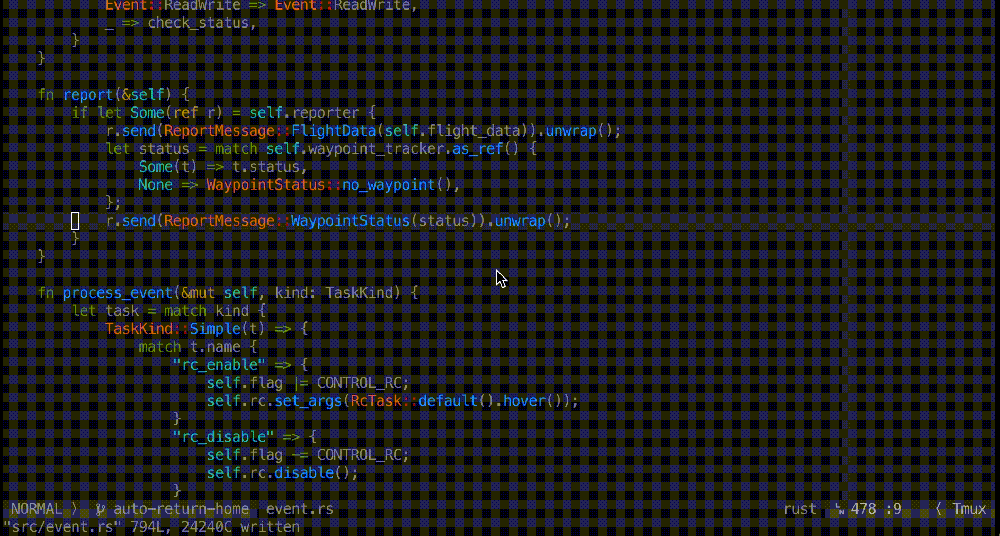

Completor 自动补全
########################

Completor 是 vim8 的异步代码完成框架。vim8 的新功能用于实现低开销的快速完成引擎。对于使用语义完成，应安装外部完成工具。

用 Vundle 插件管理器快速安装 Completor 插件：

.. highlight:: none

::

    Plugin 'maralla/completor.vim'

Vundle 安装插件的详细方法请参考 `链接 <vundle.html#id6>`_ 。

快速配置
************************

Python 代码自动补全使用 jedi 完成。必须安装 jedi 用于语义完成。将 jedi 安装到全局环境或 virtualenv：

::

    pip install jedi

其他代码语言请参考 `官网git <https://github.com/maralla/completor.vim>`_

::

    Plugin 'maralla/completor.vim'
    let g:completor_python_binary = '/path/to/python/with/jedi/installed'

    " 使用 Tab 键选择完成
    inoremap <expr> <Tab> pumvisible() ? "\<C-n>" : "\<Tab>"
    inoremap <expr> <S-Tab> pumvisible() ? "\<C-p>" : "\<S-Tab>"
    inoremap <expr> <cr> pumvisible() ? "\<C-y>" : "\<cr>"
